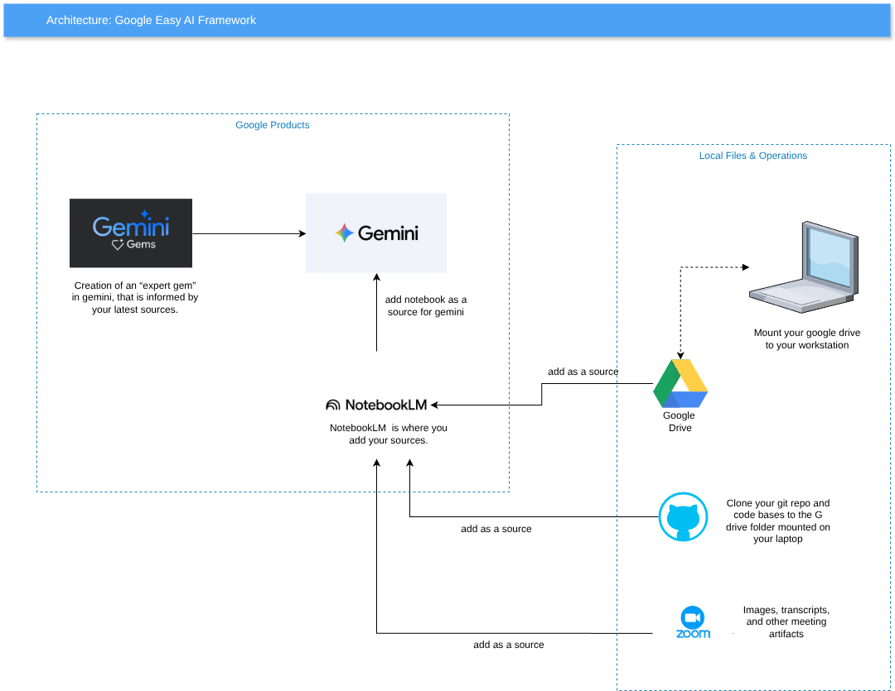

# Google AI Framework

This directory contains documentation and assets related to Google's AI ecosystem, focusing on the "Google Easy AI Framework" for streamlining data gathering and expert model creation.

## Architecture: Google Easy AI Framework

The framework provides a streamlined flow for gathering data and using it to inform Gemini expert "Gems".

### Workflow Overview
1. **Gathering Data:** Collect artifacts from various sources:
   - **Zoom:** Meeting recordings and transcripts.
   - **Google Drive:** Documents and spreadsheets.
   - **Bitbucket, GitLab, GitHub:** Repository code and documentation.
2. **Centralized Source:** Add these artifacts to **NotebookLM** as sources.
3. **AI Integration:** NotebookLM acts as the source for **Gemini**.
4. **Expert Gems:** Use the Gemini sources to create "Expert Gems" informed by the latest data.



## Getting Started

### Installation
```sh
sudo apt install npm
npx @google/gemini-cli 
```

### Usage
Run the Gemini CLI to interact with the framework:
```sh
npx @google/gemini-cli
```
